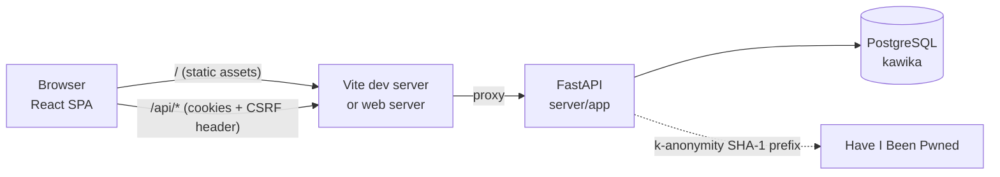
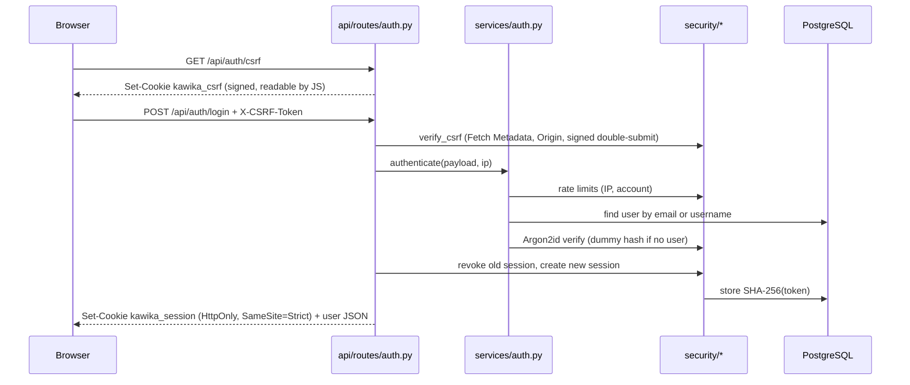

# Architecture

Kawika is a single-page React app backed by a FastAPI service and PostgreSQL. In every environment the browser talks to one origin: Vite's dev proxy locally, a reverse proxy in production.



## Request flow: logging in



## Repository layout

```
kawika/
├── client/                 React + TypeScript (Vite)
│   ├── e2e/                Playwright UAT suite
│   └── src/
│       ├── app/            App root, router, layouts
│       ├── pages/          Route-level screens that compose features
│       ├── features/       Domain modules (auth, journey, progress)
│       └── shared/         Feature-agnostic code (api client, ui, brand, styles)
├── server/                 FastAPI + SQLAlchemy + Alembic
│   ├── app/
│   │   ├── api/            HTTP layer: routes and dependencies
│   │   ├── cli/            `kawika` management commands (Typer)
│   │   ├── core/           Config, middleware, error handling
│   │   ├── db/             Engine, migrations, maintenance, seeders
│   │   ├── models/         ORM tables
│   │   ├── schemas/        Pydantic request/response bodies
│   │   ├── security/       Passwords, sessions, CSRF, rate limiting
│   │   └── services/       Business rules
│   ├── migrations/         Alembic revisions
│   └── tests/              pytest (api, unit, migrations)
├── docs/                   This documentation
└── commit-messages/        Local commit message drafts (git-ignored)
```

## Conventions

### Dependency direction

Code only depends "downwards". Nothing imports from a layer above it.

| Client | Server |
| ------ | ------ |
| `app` → `pages` → `features` → `shared` | `api` / `cli` → `services` → `security` / `models` → `db` / `core` |

- A feature never imports another feature's internals. Pages and layouts are where features meet.
- `shared` knows nothing about Kawika's domain (no users, quests, or islands).
- Server routes stay thin: parse the request, call a service, shape the response. Rules about accounts live in `services/`.

### Naming

| Kind | Convention | Example |
| ---- | ---------- | ------- |
| React components | `PascalCase.tsx`, one component per file | `LoginForm.tsx` |
| Hooks | `use-kebab-case.ts`, exported `useCamelCase` | `use-dismiss.ts` |
| Other TS modules | `kebab-case.ts` | `http-client.ts` |
| Styles | `kebab-case.css` next to their owner | `auth-page.css` |
| Unit tests | Beside the module, `*.test.ts` | `safe-redirect.test.ts` |
| E2E specs | `e2e/<area>/<flow>.spec.ts` | `e2e/auth/login.spec.ts` |
| Python modules | `snake_case.py` | `rate_limit.py` |
| Migrations | `YYYYMMDD_<rev>_<slug>.py` (generated) | `20260916_11e423ed2e19_create_users_and_auth_sessions.py` |

### Imports

- Client code uses the `@/` alias for anything outside its own folder (`@/shared/ui/Button`), so moving a file does not break long relative paths.
- Each component imports its own stylesheet. There is no global component CSS.

### Styling

Design tokens (palette, type scale, radii) live in `shared/styles/tokens.css`. Components use tokens, never raw hex values. The BEM-style class names (`block__element--modifier`) keep selectors flat and predictable.
