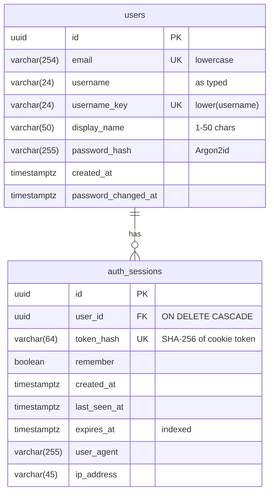

# Database

PostgreSQL 16, accessed through SQLAlchemy 2.0 with the psycopg 3 driver. The schema is managed only through Alembic migrations.

| Database | Used by |
| -------- | ------- |
| `kawika` | Local development (`DATABASE_URL`) |
| `kawika_test` | pytest and the Playwright suite (`TEST_DATABASE_URL`). Wiped freely. |

Both are owned by the `kawika` login role, and public access is revoked.

## Schema



### Constraints

| Name | Rule |
| ---- | ---- |
| `uq_users_email` | One account per email (stored lowercase) |
| `uq_users_username_key` | Usernames are unique regardless of case |
| `ck_users_email_lowercase` | `email = lower(email)` |
| `ck_users_username_key_matches` | `username_key = lower(username)` |
| `ck_users_display_name_length` | `char_length(display_name)` between 1 and 50 |
| `uq_auth_sessions_token_hash` | Each session token hash is unique |
| `fk_auth_sessions_user_id_users` | Sessions are removed with their user |

The database enforces these rules as a backstop, even though the API validates first.

## Migrations

Use the `kawika` CLI from `server/` with the virtual environment active. The full reference is in [Management CLI](cli.md).

```bash
kawika db migrate                        # apply all migrations
kawika db status                         # applied / pending + row counts
kawika db rollback                       # undo the last one
kawika db make-migration "add badges"    # after changing a model
kawika db check                          # fails if models and migrations differ
kawika db fresh --seed                   # wipe everything, rebuild, add demo data
```

Plain Alembic (`alembic upgrade head`, `alembic history`) still works. The CLI wraps the same configuration.

The workflow for a schema change:

1. Edit or add a model in `app/models/` (export new models from `app/models/__init__.py`).
2. Run `kawika db make-migration "..."` and **read the generated file**. Autogenerate misses some changes, such as renames and server defaults.
3. Run `kawika db migrate`, then `pytest`. The migration tests downgrade to base, upgrade again, and check that models match.

Constraint names come from the naming convention in `app/db/base.py`, so they stay identical between environments.

## Maintenance

Expired sessions for a user are deleted whenever that user logs in. For a periodic sweep:

```sql
DELETE FROM auth_sessions WHERE expires_at < now();
```

Inspect data locally with `psql -h 127.0.0.1 -U kawika -d kawika`.
